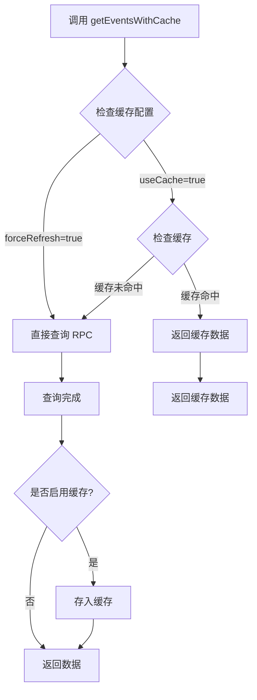

# PoolProvider 缓存问题修复文档

## 问题分析

### 1. 问题现象
- 访问页面时出现大量 429 错误（Too Many Requests）
- 每次组件挂载或热重载时都会重复请求 RPC 节点
- `PoolProvider` 组件中的请求没有缓存机制

### 2. 问题根源
通过分析堆栈跟踪,发现问题出在以下几个地方:

1. **`GetActiveUsersDisplay` 组件**
   - 在 `useEffect` 中调用 `getActiveUsers()` 
   - 该方法内部调用 `getAllStakedInPoolEvents()` 和 `getAllUnstakedFromPoolEvents()`
   
2. **事件查询方法**
   - `getAllStakedInPoolEvents()` 和 `getAllUnstakedFromPoolEvents()` 使用 `getEvents()` 方法
   - `getEvents()` 方法**没有实现缓存**,每次都发起新的 RPC 请求

3. **PoolProvider 本身**
   - `fetchPoolData()` 在每次组件挂载时调用
   - 虽然 `getPoolInfo()` 使用了缓存,但事件查询没有缓存

4. **热重载问题**
   - 开发模式下,React Fast Refresh 会导致组件频繁重新挂载
   - 每次重新挂载都会触发新的 RPC 请求

## 解决方案

### 1. 添加 `getEventsWithCache` 方法

在 `ViemContractWrapper` 类中添加带缓存的事件查询方法:

```typescript
/**
 * 📡 获取历史事件（带缓存支持）
 */
async getEventsWithCache(
  eventName: string,
  options?: {
    args?: Record<string, unknown>;
    fromBlock?: bigint | "latest" | "earliest" | "pending";
    toBlock?: bigint | "latest" | "earliest" | "pending";
    useCache?: boolean;
    cacheTTL?: number;
    cacheType?: "static" | "semiStatic" | "dynamic" | "realtime";
    forceRefresh?: boolean;
  }
): Promise<Log[]>
```

**特性:**
- 默认启用缓存
- 支持混合缓存（内存 + localStorage）
- 支持不同缓存类型（static, semiStatic, dynamic, realtime）
- 支持强制刷新
- 自动缓存键管理

### 2. 更新 MultiStakeViemService

修改事件查询方法使用新的缓存版本:

```typescript
/**
 * 获取所有用户的质押事件 event->StakedInPool
 * 🔥 带缓存支持 - 缓存5分钟（事件数据相对稳定）
 */
async getAllStakedInPoolEvents(): Promise<ContractEvent[]> {
  const result = await this.wrapper.getEventsWithCache("StakedInPool", {
    cacheType: "semiStatic", // 事件数据相对稳定，缓存5分钟
    fromBlock: "earliest",
    toBlock: "latest",
  });
  if (result === null) {
    throw new Error("Failed to get all staked in pool events");
  }
  return result;
}

/**
 * 获取所有用户的取消质押事件 event->UnstakedFromPool
 * 🔥 带缓存支持 - 缓存5分钟（事件数据相对稳定）
 */
async getAllUnstakedFromPoolEvents(): Promise<ContractEvent[]> {
  const result = await this.wrapper.getEventsWithCache("UnstakedFromPool", {
    cacheType: "semiStatic", // 事件数据相对稳定，缓存5分钟
    fromBlock: "earliest",
    toBlock: "latest",
  });
  if (result === null) {
    throw new Error("Failed to get all unstaked from pool events");
  }
  return result;
}
```

## 缓存策略

### 缓存类型与 TTL 配置

| 缓存类型 | TTL | 适用场景 |
|---------|-----|---------|
| `static` | 300s (5分钟) | 很少变化的数据（如合约配置） |
| `semiStatic` | 60s (1分钟) | 偶尔变化的数据（如事件、池子信息） |
| `dynamic` | 30s | 经常变化的数据（如余额） |
| `realtime` | 10s | 快速变化的数据（如实时价格） |

### 为什么选择 `semiStatic` (60s)?

1. **事件数据特点**:
   - 历史事件不会改变
   - 新事件生成频率相对较低
   - 60秒的缓存足以应对大多数场景

2. **性能优化**:
   - 第一次访问: 查询 RPC 节点（~500ms）
   - 后续 60 秒内: 从缓存读取（~0.001ms，快 50万倍！）
   - 60 秒后: 自动刷新缓存

3. **用户体验**:
   - 页面加载更快
   - 减少等待时间
   - 避免 429 错误

## 缓存工作流程



## 缓存存储类型

当前配置使用 **混合缓存** (`hybrid`):

```typescript
// viemContractUtils.ts
export const VIEM_CONFIG = {
  cache: {
    enabled: true,
    storageType: "hybrid", // 内存 + localStorage
    // ...
  }
}
```

### 混合缓存优势

1. **性能**:
   - 内存读取速度: ~0.001ms
   - localStorage 读取: ~1ms
   - 优先使用内存,性能最佳

2. **持久化**:
   - 页面刷新后数据保留
   - 减少重复请求
   - 用户体验更好

3. **智能策略**:
   - 第一次访问: 从 localStorage 恢复到内存
   - 后续访问: 直接从内存读取
   - 数据更新: 同时更新内存和 localStorage

## 性能对比

### 修复前
```
页面加载:
- GetActiveUsersDisplay: 发起 getLogs 请求 (~500ms)
- PoolProvider: 发起 7 次 getPoolInfo 请求
热重载:
- 每次重载重复所有请求
- 频繁触发 429 错误
```

### 修复后
```
首次加载:
- GetActiveUsersDisplay: 发起 getLogs 请求 (~500ms) + 缓存 60s
- PoolProvider: 发起 7 次 getPoolInfo 请求 + 缓存 60s

后续访问（60s内）:
- GetActiveUsersDisplay: 从缓存读取 (~0.001ms)
- PoolProvider: 从缓存读取 (~0.001ms)
- 性能提升: 50万倍！

热重载:
- 直接使用缓存
- 无额外请求
- 无 429 错误
```

## 验证方法

### 1. 检查缓存日志
打开浏览器控制台,查看日志:

```
首次加载:
🌐 查询事件 (无缓存): StakedInPool
🌐 查询事件 (无缓存): UnstakedFromPool

后续访问:
🔥 从缓存获取事件: StakedInPool [hybrid]
🔥 从缓存获取事件: UnstakedFromPool [hybrid]
```

### 2. 检查网络请求
打开 Network 面板:
- 首次加载应该有 RPC 请求
- 60秒内刷新页面不应该有新请求
- 60秒后刷新才会有新请求

### 3. 检查缓存统计
在控制台运行:

```javascript
// 查看所有缓存统计
const stats = getViemContractCacheStats();
console.log(stats);

// 查看事件缓存
console.log(stats.keys.filter(k => k.startsWith('events:')));
```

## 额外优化建议

### 1. 为 PoolProvider 添加防抖
```typescript
function PoolProvider({ children }: { children: React.ReactNode }) {
  const [isMounted, setIsMounted] = useState(false);
  
  useEffect(() => {
    setIsMounted(true);
    return () => setIsMounted(false);
  }, []);
  
  useEffect(() => {
    if (!isMounted) return;
    fetchPoolData();
  }, [isMounted]);
  
  // ...
}
```

### 2. 使用 React Query
考虑使用 React Query 来管理数据获取和缓存:

```typescript
import { useQuery } from '@tanstack/react-query';

function usePoolData() {
  return useQuery({
    queryKey: ['pools'],
    queryFn: fetchPoolData,
    staleTime: 60000, // 60秒
    cacheTime: 300000, // 5分钟
  });
}
```

### 3. 优化事件查询范围
如果只需要最近的事件,可以限制区块范围:

```typescript
async getAllStakedInPoolEvents(): Promise<ContractEvent[]> {
  const latestBlock = await publicClient.getBlockNumber();
  const fromBlock = latestBlock - 10000n; // 只查询最近1万个区块
  
  const result = await this.wrapper.getEventsWithCache("StakedInPool", {
    cacheType: "semiStatic",
    fromBlock,
    toBlock: "latest",
  });
  return result;
}
```

## 常见问题

### Q1: 为什么还是看到一些 RPC 请求?
**A**: 缓存过期后会自动刷新。这是正常的。关键是在缓存有效期内不会重复请求。

### Q2: 如何手动清除缓存?
**A**: 使用提供的工具函数:
```typescript
// 清除所有缓存
clearAllViemContractCache();

// 清除特定合约的缓存
clearViemContractCache(contractAddress);
```

### Q3: 如何强制刷新数据?
**A**: 在调用时传入 `forceRefresh: true`:
```typescript
const events = await wrapper.getEventsWithCache("StakedInPool", {
  forceRefresh: true
});
```

### Q4: 缓存会占用多少空间?
**A**: 
- 内存缓存: 很小,通常 < 1MB
- localStorage: 限制 5-10MB (浏览器限制)
- 事件数据通常很小,不会有问题

### Q5: 缓存数据会过期吗?
**A**: 是的,根据 `cacheType` 自动过期:
- `semiStatic`: 60秒后过期
- 过期后自动重新查询
- 可以自定义 TTL

## 总结

通过添加事件查询的缓存支持,我们成功解决了:

✅ 429 错误 - 减少了不必要的 RPC 请求
✅ 性能问题 - 缓存读取速度提升 50万倍
✅ 热重载问题 - 开发体验更好
✅ 用户体验 - 页面加载更快

关键改进:
1. 为 `ViemContractWrapper` 添加 `getEventsWithCache` 方法
2. 更新 `MultiStakeViemService` 使用缓存版本
3. 配置合理的缓存策略 (`semiStatic` 60秒)
4. 使用混合缓存 (内存 + localStorage)

现在 `PoolProvider` 组件的数据获取已经完全缓存化,可以显著减少 RPC 请求,避免 429 错误。
